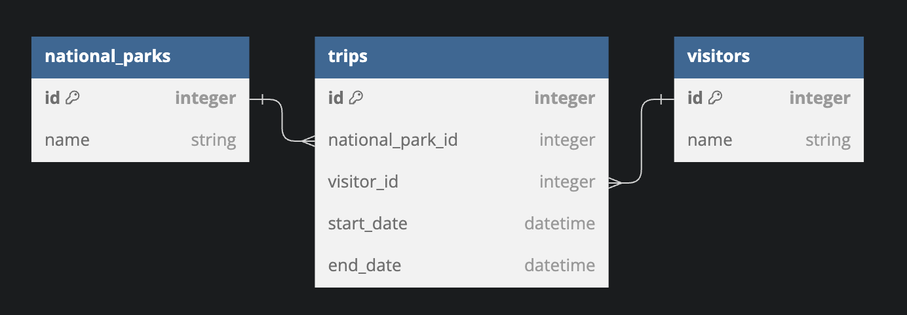

# National Parks - Flask Practice

For this assessment, you'll be working with a National Park domain.

In this repo:

- There is a Flask application with some features built out.

You can either check your API by:

- Using Postman to make requests
- Building out a React frontend

## Setup

To download the dependencies, run:

```console
pipenv install
pipenv shell
```

You can run your Flask API on [`localhost:5555`](http://localhost:5555) by
running:

```console
python server/app.py
```

Your job is to build out the Flask API to add the functionality described in the
deliverables below.

## Models

You will implement an API for the following data model:



The file `server/models.py` defines the model classes **without relationships**.
Use the following commands to create the initial database `app.db`:

```console
export FLASK_APP=server/app.py
flask db init
flask db upgrade head
```

Now you can implement the relationships as shown in the ER Diagram:

- A `Visitor` has many `NationalPark`s through `Trip`
- A `NationalPark` has many `Visitor`s through `Trip`
- A `Trip` belongs to a `Visitor` and belongs to a `NationalPark`

Update `server/models.py` to establish the model relationships. Since a
`Trip` belongs to a `Visitor` and a `NationalPark`, configure the model
to cascade deletes.

Set serialization rules to limit the recursion depth.

Run the migrations and seed the database:

```console
flask db revision --autogenerate -m 'message'
or 
flask db migrate -m 'message'
flask db upgrade head
python server/seed.py
```

> If you aren't able to get the provided seed file working, you are welcome to
> generate your own seed data to test the application.

## Validations

Add validations to the `Trip` model:

- `visitor_id` must be an existing Vistor(`id` in the `vistors` table)
- `national_park_id` must be an existing National Park(`id` in the `national_parks` table)


## Routes

Set up the following routes. Make sure to return JSON data in the format
specified along with the appropriate HTTP verb.

Recall you can specify fields to include or exclude when serializing a model
instance to a dictionary using to_dict() (don't forget the comma if specifying a
single field).

NOTE: If you choose to implement a Flask-RESTful app, you need to add code to
instantiate the `Api` class in server/app.py.

### GET /national_parks

Return JSON data in the format below:

```json
[
  {
    "id": 1,
    "name": "Yosemite",
  },
  {
    "id": 2,
    "name": "Yellowstone",   
  },
  {
    "id": 3,
    "name": "Pinnacles",
  }
]
```

Recall you can specify fields to include or exclude when serializing a model
instance to a dictionary using `to_dict()` (don't forget the comma if specifying
a single field).

### GET /national_parks/<int:id>

If the `NationalPark` exists, return JSON data in the format below:

```json
{
  "id": 1,
  "name": "Yosemite",
  "trips": [
    {
      "end_date": "2023-11-20 03:02:03",
      "id": 1,
      "national_park_id": 1,
      "start_date": "2023-11-20 03:02:03",
      "visitor": {
          "id": 1,
          "name": "Karen"
      },
      "visitor_id": 1
    },
    {
      "end_date": "2023-11-20 03:02:03",
      "id": 2,
      "national_park_id": 1,
      "start_date": "2023-11-20 03:02:03",
      "visitor": {
          "id": 2,
          "name": "Kiki"
      },
      "visitor_id": 2
    }
  ]
}

```

If the `NationalPark` does not exist, return the following JSON data, along with
the appropriate HTTP status code:

```json
{
  "error": "National Park not found"
}
```

### DELETE /visitors/<int:id>

If the `Visitor` exists, it should be removed from the database, along with
any `Trip`s that are associated with it (a `Trip` belongs
to a `Visitor`). If you did not set up your models to cascade deletes, you
need to delete associated `Trip`s before the `Visitor` can be
deleted.

After deleting the `Visitor`, return an _empty_ response body, along with the
appropriate HTTP status code.

If the `Visitor` does not exist, return the following JSON data, along with
the appropriate HTTP status code:

```json
{
  "error": "Visitor not found"
}
```

### GET /trips

Return JSON data in the format below:

```json
[
  {
    "end_date": "2023-11-20 03:02:03",
    "id": 3,
    "national_park_id": 2,
    "start_date": "2023-11-20 03:02:03",
    "visitor_id": 2
  },
  {
    "end_date": "2023-11-20 03:02:03",
    "id": 4,
    "national_park_id": 2,
    "start_date": "2023-11-20 03:02:03",
    "visitor_id": 2
  },
  {
    "end_date": "2023-11-20 03:02:03",
    "id": 5,
    "national_park_id": 3,
    "start_date": "2023-11-20 03:02:03",
    "visitor_id": 3
  },
  {
    "end_date": "2023-11-20 03:02:03",
    "id": 6,
    "national_park_id": 3,
    "start_date": "2023-11-20 03:02:03",
    "visitor_id": 3
  }
]
```

### POST /trips

This route should create a new `Trip` that is associated with an
existing `Visitor` and `NationalPark`. It should accept an object with the following
properties in the body of the request:

```json
{
  "visitor_id": 1,
  "national_park_id": 3,
  "start_date": "2023-11-18 03:22:39",
  "end_date": "2023-11-20 03:30:00"
}
```

If the `Trip` is created successfully, send back a response with the
data related to the `Trip`:

```json

  {
    "end_date": "2023-11-20 03:02:03",
    "id": 6,
    "national_park": {
      "id": 3,
      "name": "Pinnacles"
    },
    "national_park_id": 3,
    "start_date": "2023-11-20 03:02:03",
    "visitor": {
      "id": 3,
      "name": "Sanjay"
    },
    "visitor_id": 3
  }

```

If the `Trip` is **not** created successfully due to a validation
error, return the following JSON data, along with the appropriate HTTP status
code:

```json
{
  "errors": ["validation errors"]
}
```
